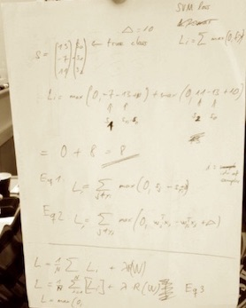

+++
date = "2016-09-11T14:34:24+02:00"
draft = true
title = "linear classification"

+++

Table of Contents:

- [Intro to Linear classification](#intro)
- [Parameterized mapping - from images to label scores](#mapping)
- [Interpreting a Linear Classifier](#interpreting_lin_cl)

These are my personal notes about [course cs231n](http://cs231n.stanford.edu/) from Stanford university. (Full disclaimer?

## Linear Classification
The k-Nearest Neighbor classifier is probably the most basic classifier one could think of. It simply remembers all the training data and then samples from the test set are simply compared to each sample of the training set. The score is the euclidean distance of each pair. Sadly, it comes with a couple of critical disadvantages:

- The kNN classifier needs to remember all training data in order to do the comparisons with future training data. This is space inefficient. (**memory**)
- A new test sample needs to be compared to every training sample in order to get classified. This takes a lot of time. (**CPU**)

**Overview** Hence, here is a more powerful apporach.
It consists of three key components.

- Score function - It maps the raw data to class scores.
- Loss function - It computes the error between prediction and reference data.
- Optimization - *Covered in the next chapter.*

### Parameterized mapping - from images to label scores

The general form of a score function is 
$$
y = f(x)
$$

where $y$ is the reference data and x are the training samples/features.
More formally written:

$$
f: \mathbb{R}^{D} \mapsto \mathbb{R}^K
$$

A $D$-dimensional feature is mapped to one of $K$ scores using a function $f$.

#### Linear Classifier
Now we need to define this **score function** $f$:

In its simplest form it is a linear function:

$$
y = f(x_i,W,b) = Wx_i + b
$$

$Wx_i$ is a multiplication of the trained weights $W$ with a sample $x_i$. The number of rows of $W$ corresponds to the number of classes, i.e. this matrix multiplication is a *parallel* evaluation of 10 seperate classifiers.
**Every row of $W$ is a classifier for one of the classes.**

### Interpreting a Linear Classifier

If $x_i$ are the raw pixel values then $x_i$ can be seen as a point in a **pixel space**. Later this will be the feature space.

#### Geometric Interpretation 
- This linear equation defines the decision boundary.
- If you alter $W$ you rotate the decision boundary.
- If you alter $b$ you translate (parallel shift) the decision boundary.
  - This means, without the bias term the *decision boundary would be forced to cross the origin*. This, however, doesn't represent the reality well.
  
#### Interpretation of linear classifiers as template matching

The linear classifier can also be seen as a template matcher. Each row $m$ in $W$ corresponds to a template. Each image sample is compared to the templates by using the inner product:

$$
W(m,:)^T \cdot \vec{x_i} =...=  \vec{a} \cdot \vec{b} = \sum_{i=1}^{N}a_i b_i
$$

As you can see the inner product is just a part of the matrix-vector multiplication above. 
- The higher the score, the better the sample fits to the model.
- Template matching is equivalent to computing the inner product of $W(m,:)$ and $x_i$.
- Linear classification can be seen as a more advanced version of kNN classifier. We compute the inner product instead of the $L_1$ or $L_2$ distance. We do not compare it with every training example but only with the (learned) average image or template.
- It should be added that the scores, we compute with the inner product, indicate the correct label, which is some kind of error metric as the Lp distance. **However, it is not really considered as a loss function** (see chapter loss function for details.) 

Result: The learned template for a ship most likely has a lot of blue pixels (ocean) in it. But what if there is an image with a ship with out water to be classified?

Neural nets are able to generalize much better on this using several hidden layers.

#### Bias trick
- Add another element with value $1$ to every image sample $x_i$. Then $x_i \in \mathbb{R}^{D+1}$
- Concatenate $W$ and $\vec{b}$ horizontally, 
 These two steps lead to the same equation as above:
$$
 y = f(x_i,W,b) = Wx_i + b = f(x_i',W')
 $$
 

#### Image data ***pre***processing
- **Mean image:** Always center your data by subtracting the mean of every feature (here: the raw pixel values). Result: $x_{i,d} \in [-127,...,127]$
 
- **Scale image:** Additionally one could scale it to $x_{i,d} \in [-1,...,1]$

### Loss function (== Cost function == Objective function)
The images $x_i$ and the reference labels $y_i$ are given and fixed. So we need to change/train $W$ in order to minimize the error between predictions and reference.
The error can be measured with the loss function. The smaller the difference is the better was the prediction.

### Multi-class Support Vector Machine (SVM) Loss

 The SVM loss is defined in a way that the correct class should have a higher score than the incorrect classes.

*Fig: Hand-written notes and and example*

**In fact, the SVM loss demands that the correct class has a higher score by a specific margin than all other. If not it accumulates loss.**
$$
L_i = \sum_{j \neq y_i} max(0,s_j - s_{y_i} + \Delta)
$$

The same equation for the special case of a linear score function $s_j = f(x_i,W)_j$:

$$
L_i = \sum_{j \neq y_i} max(0, w^T_j x_i - w^T_{y_i} x_i + \Delta )
$$
- We substitute s for the linear classification formula.
- $w^T$ is one specific template, one row, of the weight matrix $W$. In order to compute the inner product, we transpose the row vector into a column vector.
- **Hinge loss** is the loss function with threshold-at-zero property.

#### Regularization
Up to now the loss function would be zero $(L_i=0)$ for several different sets of $W$. 
But we wish to remove this ambiguity (why: see below?)

Regularization terms are part of the loss function and are independent of the data samples $x$.
The most common regularization penalty is the L2 norm.
$$
L= 1/N \left( \sum_{i=1}^N L_i \right) + \lambda R(W) ,where \\ R(W) = \sum_k \sum_l W^2_{k,l}
$$
*Eq: Full equation of the multiclass SVM loss*

Because it penalizes the elements quadraticly, larger weights are more penalized than smaller weights.

So why do we want to penalize larger values or peaks in specific dimensions of matrix $W$.
*The classifier should be encouraged to take **all** dimensions into account* as this fact improves generalization and leads to less overfitting. For example, if there is no regularization then a weight vector $w_1=[1,0,0,0]$ would have the same score as the vector $w_2=[0.25,0.25,0.25,0.25]$, since $w_1^Tx = w_2^Tx = 1$.

The bias term does not need to be regularized.

### Practical Considerations

#### Delta $\Delta$
Delta is a hyperparameter. Usually, the optimal value for a hyperparameter can be found by using cross-validation. However, both $\Delta$ and $\lambda$ do control the same thing. With $\lambda$ you have direct influence on the score differences. This fact makes the adjustment of $\Delta$ meaningless - ** it can safely be set to $\Delta = 1.0$ in all cases.

#### SVM - Is this already the whole SVM?
The rest of this section discusses differences between different SVM versions (One-vs-all, Structured SVM, etc.) Not really a priority at the moment. *However, it is somehow suprising that the above equations seem to formalize a complete SVM?* Not really sure... It would mean that the SVM score function is a simple linear classifier and the loss function introduces a margin with regularization to let the correct class stand out.
Of course, there was nothing about kernels yet, but the rest... have to check later.

### Softmax classifier

The Softmax classifier has a different loss function.
**It is the generalized version of logistic regression which works for multiple classes.**

The softmax function assigns a normalized probability to a given score by these two steps:
- Exponentiation of the scores gives an unnormalized probability.
- Division of the scores performs the normalization, so that the probabilities sum to one.
$$
P(y_i|x_i;W) = \frac{e^{f_{y_i}}}{\sum_j e^{f_j}}
$$
*Eq: Softmax function*

**Aside:**
- This can be interpreted as Maximum Likelihood Estimation (MLE).
- The full loss function, i.e. including regularization, can then be interpreted as a Maximum a posterori (MAP) estimation
- *WTF??*

**Numeric stability:**
- Always thrive for zero mean and equal variance (besides the issues described above)
- Never divide really large numbers, you can use a normalization trick to avoid this.

#### SVM vs. Softmax

- SVM uses the hinge loss function whereas Softmax uses the cross-entropy loss function.
- SVM classifier gives you scores, the Softmax classifier gives you probabilities.
- However, these "probabilities" should be rather seen as confidence values because the probability distribution directly depends on the regularization parameter lambda - which you choose. The ordering of the scores is interpretable, but not the absolute numbers.

#### SVM vs. Softmax in practice. When do you choose what?
- SVM can be thought of as more ruthless because it is only interested in if the margins are satisfied. It is not interested how large the difference of the scores is as long as the margin is met.
- The Softmax always can have higher or lower probabilities, the loss always could get better. Sometimes, this is not desirable.

### Summary

- Definition of a score function $f$. In this chapter it was always a linear function depending on weights and biases.
- It is a parametric apporach. Ones the classifier is learned, the training data can be discarded. This is a huge advantage compared to a kNN classifier.

- Definition of two loss functions commonly used for linear classifiers: SVM and Softmax.

